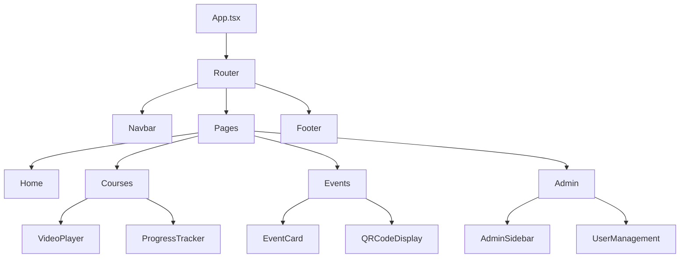
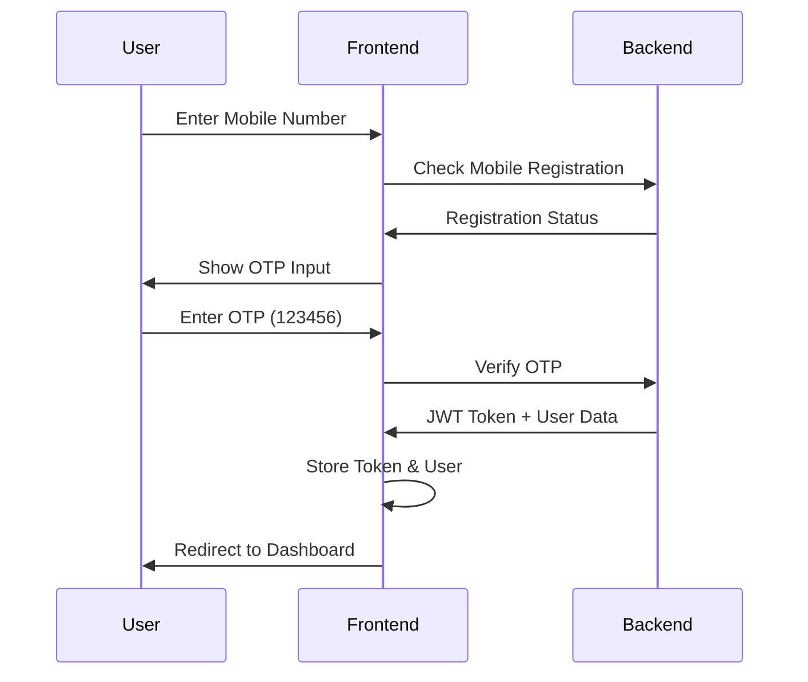

# 🕉️ Sivoham - Spiritual Growth Platform (Frontend)

## 📋 Table of Contents
- [Overview](#overview)
- [Features](#features)
- [Technology Stack](#technology-stack)
- [Project Structure](#project-structure)
- [Installation & Setup](#installation--setup)
- [Environment Configuration](#environment-configuration)
- [Component Architecture](#component-architecture)
- [Routing System](#routing-system)
- [State Management](#state-management)
- [UI/UX Design](#uiux-design)
- [API Integration](#api-integration)
- [Authentication System](#authentication-system)
- [Internationalization](#internationalization)
- [Performance Optimizations](#performance-optimizations)
- [Testing](#testing)
- [Deployment](#deployment)
- [Contributing](#contributing)

---

## 🎯 Overview

Sivoham is a comprehensive spiritual growth platform built with React and TypeScript, designed to provide authentic Kundalini Yoga teachings from Parama Pujya Sree Jeeveswara Yogi. The platform offers structured courses, event management, progress tracking, and community features.

### **Key Objectives**
- Provide accessible spiritual education globally
- Maintain authentic traditional teachings
- Create an engaging learning experience
- Build a connected spiritual community
- Offer comprehensive progress tracking

---

## ✨ Features

### **🏠 Public Pages**
- **Landing Page**: Beautiful homepage with spiritual aesthetics
- **About Section**: Detailed information about Guruji and teachings
- **Programs Overview**: 5-level structured course system
- **Gallery**: Visual journey of spiritual events and practices
- **Testimonials**: Real experiences from practitioners worldwide

### **🔐 Authentication System**
- **OTP-based Login**: Secure mobile number verification
- **Registration Flow**: Comprehensive user onboarding
- **Session Management**: Persistent login across devices
- **Demo Mode**: Easy testing with predefined credentials

### **🎓 Learning Management**
- **Progressive Course System**: 5 levels of spiritual development
- **Video Player**: HLS streaming with adaptive quality
- **Progress Tracking**: Detailed learning analytics
- **Meditation Tests**: Interactive spiritual assessments
- **Offline Capability**: Download content for offline viewing

### **🎪 Event Management**
- **Event Discovery**: Browse upcoming spiritual events
- **Registration System**: Detailed participant information collection
- **QR Code Integration**: Digital entry management
- **Event Types**: Unlimited and limited capacity events
- **Notification System**: WhatsApp integration for updates

### **📊 User Dashboard**
- **Progress Analytics**: Comprehensive learning statistics
- **Course Navigation**: Easy access to all levels
- **Event History**: Past and upcoming event participation
- **Profile Management**: Personal information updates

### **📱 Mobile Experience**
- **Responsive Design**: Optimized for all screen sizes
- **Touch-friendly Interface**: Mobile-first approach
- **Progressive Web App**: App-like experience on mobile
- **Offline Support**: Core functionality without internet

---

## 🛠️ Technology Stack

### **Core Technologies**
```json
{
  "framework": "React 18.2.0",
  "language": "TypeScript 4.9.5",
  "ui_library": "Material-UI 5.14.0",
  "routing": "React Router 6.15.0",
  "http_client": "Axios 1.5.0",
  "state_management": "React Hooks + Context API",
  "internationalization": "react-i18next 13.2.0"
}
```

### **Development Tools**
```json
{
  "build_tool": "Create React App",
  "package_manager": "npm",
  "code_quality": "ESLint + Prettier",
  "version_control": "Git",
  "deployment": "Vercel/Netlify"
}
```

### **Additional Libraries**
```json
{
  "video_player": "HLS.js for adaptive streaming",
  "qr_generation": "qrcode library",
  "date_handling": "date-fns",
  "icons": "Material-UI Icons",
  "animations": "CSS transitions + Material-UI animations"
}
```

---

## 📁 Project Structure

```
sivoham-react/
├── public/
│   ├── images/                    # Static images and assets
│   │   ├── SKS_Logo_4K-1.png     # Main logo
│   │   ├── guruji_about.png      # Guruji images
│   │   ├── chakras.png           # Spiritual imagery
│   │   └── events/               # Event photos
│   ├── locales/                  # Translation files
│   └── manifest.json             # PWA configuration
├── src/
│   ├── components/               # Reusable UI components
│   │   ├── admin/               # Admin-specific components
│   │   │   ├── AdminSidebar.tsx
│   │   │   ├── AdminUsersTab.tsx
│   │   │   ├── EventsManagement.tsx
│   │   │   └── ...
│   │   ├── courses/             # Course-related components
│   │   │   ├── VideoPlayer.tsx
│   │   │   ├── CourseCard.tsx
│   │   │   └── ProgressTracker.tsx
│   │   ├── events/              # Event components
│   │   │   ├── EventCard.tsx
│   │   │   ├── EventRegistration.tsx
│   │   │   └── QRCodeDisplay.tsx
│   │   ├── common/              # Shared components
│   │   │   ├── Navbar.tsx
│   │   │   ├── Footer.tsx
│   │   │   ├── ErrorBoundary.tsx
│   │   │   └── JaiGurudevLoader.tsx
│   │   └── LoginDialog.tsx
│   ├── pages/                   # Page components
│   │   ├── Home.tsx            # Landing page
│   │   ├── Courses.tsx         # Course listing
│   │   ├── Events.tsx          # Event management
│   │   ├── Join.tsx            # Registration page
│   │   ├── Profile.tsx         # User profile
│   │   ├── Programs.tsx        # Program overview
│   │   ├── Gallery.tsx         # Image gallery
│   │   ├── Testimonials.tsx    # User testimonials
│   │   └── AdminRequests.tsx   # Admin dashboard
│   ├── contexts/               # React Context providers
│   │   └── PermissionContext.tsx
│   ├── services/               # API and external services
│   │   ├── api.ts             # API client configuration
│   │   └── auth.ts            # Authentication utilities
│   ├── locales/               # Internationalization
│   │   ├── en/
│   │   │   └── translation.json
│   │   └── te/
│   │       └── translation.json
│   ├── styles/                # Global styles and themes
│   │   ├── globals.css
│   │   └── theme.ts
│   ├── utils/                 # Utility functions
│   │   ├── constants.ts
│   │   ├── helpers.ts
│   │   └── validators.ts
│   ├── types/                 # TypeScript type definitions
│   │   ├── user.ts
│   │   ├── course.ts
│   │   └── event.ts
│   ├── App.tsx               # Main application component
│   ├── index.tsx             # Application entry point
│   └── setupTests.ts         # Test configuration
├── package.json              # Dependencies and scripts
├── tsconfig.json            # TypeScript configuration
├── .env.example             # Environment variables template
└── README.md               # This file
```

---

## 🚀 Installation & Setup

### **Prerequisites**
```bash
Node.js >= 16.0.0
npm >= 8.0.0
Git
```

### **Quick Start**
```bash
# Clone the repository
git clone https://github.com/your-org/sivoham-react.git
cd sivoham-react

# Install dependencies
npm install

# Copy environment configuration
cp .env.example .env.local

# Start development server
npm start
```

### **Development Scripts**
```bash
# Start development server
npm start

# Build for production
npm run build

# Run tests
npm test

# Run tests with coverage
npm run test:coverage

# Lint code
npm run lint

# Format code
npm run format

# Type check
npm run type-check

# Analyze bundle size
npm run analyze
```

---

## ⚙️ Environment Configuration

### **Environment Variables**
```bash
# .env.local
REACT_APP_API_URL=http://localhost:5000/api
REACT_APP_ENVIRONMENT=development
REACT_APP_VERSION=1.0.0
REACT_APP_ENABLE_ANALYTICS=false
REACT_APP_CDN_URL=https://cdn.sivoham.org
REACT_APP_HLS_ENABLED=true
REACT_APP_OFFLINE_MODE=false
```

### **Production Configuration**
```bash
# .env.production
REACT_APP_API_URL=https://api.sivoham.org/api
REACT_APP_ENVIRONMENT=production
REACT_APP_ENABLE_ANALYTICS=true
REACT_APP_CDN_URL=https://cdn.sivoham.org
REACT_APP_HLS_ENABLED=true
REACT_APP_OFFLINE_MODE=true
```

---

## 🏗️ Component Architecture

### **Component Hierarchy**


### **Key Components**

#### **🎥 VideoPlayer Component**
```typescript
interface VideoPlayerProps {
  videoUrl: string;
  courseId: string;
  levelId: string;
  onProgress: (progress: number) => void;
  onComplete: () => void;
  hlsEnabled?: boolean;
}
```

#### **📊 ProgressTracker Component**
```typescript
interface ProgressData {
  currentLevel: number;
  completedLevels: number;
  totalWatchTime: number;
  lastActivity: Date;
  levelDetails: {
    [key: string]: {
      completed: boolean;
      watchTime: number;
      completedAt?: Date;
    };
  };
}
```

#### **🎪 EventCard Component**
```typescript
interface EventCardProps {
  event: {
    _id: string;
    name: string;
    date: Date;
    venue: string;
    description: string;
    eventType: 'unlimited' | 'limited';
    registrationDeadline?: Date;
  };
  onRegister: (eventId: string) => void;
  userRegistration?: EventRegistration;
}
```

---

## 🛣️ Routing System

### **Route Configuration**
```typescript
const routes = [
  { path: '/', component: Home, public: true },
  { path: '/join', component: Join, public: true },
  { path: '/courses', component: Courses, protected: true },
  { path: '/events', component: Events, protected: false },
  { path: '/profile', component: Profile, protected: true },
  { path: '/admin', component: AdminRequests, admin: true }
];
```

### **Protected Routes**
```typescript
interface ProtectedRouteProps {
  children: React.ReactNode;
  requireAuth?: boolean;
  requireAdmin?: boolean;
  fallback?: React.ReactNode;
}
```

### **Navigation Structure**
```typescript
const navigationItems = [
  { label: 'Home', path: '/', public: true },
  { label: 'About', path: '/#about', public: true },
  { label: 'Programs', path: '/#programs', public: true },
  { label: 'Gallery', path: '/#gallery', public: true },
  { label: 'Testimonials', path: '/#testimonials', public: true },
  { label: 'Courses', path: '/courses', protected: true },
  { label: 'Events', path: '/events', protected: false },
  { label: 'Profile', path: '/profile', protected: true },
  { label: 'Admin', path: '/admin', admin: true }
];
```

---

## 🔄 State Management

### **Context Providers**
```typescript
// User Context
interface UserContextType {
  user: User | null;
  loading: boolean;
  login: (credentials: LoginCredentials) => Promise<void>;
  logout: () => void;
  updateProfile: (data: Partial<User>) => Promise<void>;
}

// Permission Context
interface PermissionContextType {
  permissions: UserPermissions;
  hasPermission: (resource: string, action: string) => boolean;
  isSuperAdmin: () => boolean;
}
```

### **Custom Hooks**
```typescript
// useAuth Hook
const useAuth = () => {
  const context = useContext(UserContext);
  if (!context) {
    throw new Error('useAuth must be used within UserProvider');
  }
  return context;
};

// useApi Hook
const useApi = <T>(endpoint: string, options?: RequestOptions) => {
  const [data, setData] = useState<T | null>(null);
  const [loading, setLoading] = useState(true);
  const [error, setError] = useState<string | null>(null);
  
  // Implementation...
  return { data, loading, error, refetch };
};
```

---

## 🎨 UI/UX Design

### **Design System**
```typescript
const theme = {
  palette: {
    primary: {
      main: '#de6b2f',
      dark: '#b45309',
      light: '#ff9c5f'
    },
    secondary: {
      main: '#b794f4',
      dark: '#9575cd',
      light: '#d1c4e9'
    },
    background: {
      default: '#fff7f0',
      paper: '#ffffff'
    }
  },
  typography: {
    fontFamily: 'Lora, serif',
    h1: { fontSize: '2.5rem', fontWeight: 700 },
    h2: { fontSize: '2rem', fontWeight: 600 },
    body1: { fontSize: '1rem', lineHeight: 1.6 }
  },
  spacing: 8,
  borderRadius: 12
};
```

### **Responsive Breakpoints**
```typescript
const breakpoints = {
  xs: 0,      // Mobile
  sm: 600,    // Tablet
  md: 960,    // Desktop
  lg: 1280,   // Large Desktop
  xl: 1920    // Extra Large
};
```

### **Component Styling Patterns**
```typescript
// Consistent styling approach
const useStyles = makeStyles((theme) => ({
  card: {
    borderRadius: theme.spacing(2),
    boxShadow: '0 4px 20px rgba(222,107,47,0.15)',
    background: 'linear-gradient(135deg, #fff7f0 0%, #ffeee0 100%)',
    border: '1px solid rgba(222,107,47,0.2)'
  },
  button: {
    borderRadius: theme.spacing(1),
    fontFamily: 'Lora, serif',
    fontWeight: 600,
    textTransform: 'none',
    background: 'linear-gradient(90deg, #de6b2f 0%, #b45309 100%)'
  }
}));
```

---

## 🔌 API Integration

### **API Client Configuration**
```typescript
// services/api.ts
const API_BASE_URL = process.env.REACT_APP_API_URL || 'http://localhost:5000/api';

class ApiClient {
  private baseURL: string;
  private defaultHeaders: Record<string, string>;

  constructor() {
    this.baseURL = API_BASE_URL;
    this.defaultHeaders = {
      'Content-Type': 'application/json'
    };
  }

  private getAuthHeaders(): Record<string, string> {
    const token = localStorage.getItem('token');
    return token ? { Authorization: `Bearer ${token}` } : {};
  }

  async request<T>(
    endpoint: string, 
    options: RequestInit = {}
  ): Promise<T> {
    const url = `${this.baseURL}${endpoint}`;
    const headers = {
      ...this.defaultHeaders,
      ...this.getAuthHeaders(),
      ...options.headers
    };

    try {
      const response = await fetch(url, { ...options, headers });
      
      if (!response.ok) {
        throw new Error(`HTTP ${response.status}: ${response.statusText}`);
      }

      return await response.json();
    } catch (error) {
      console.error('API Request failed:', error);
      throw error;
    }
  }
}

export const apiClient = new ApiClient();
```

### **API Service Methods**
```typescript
// User Services
export const userService = {
  login: (mobile: string, otp: string) => 
    apiClient.request('/auth/login', {
      method: 'POST',
      body: JSON.stringify({ mobile, otp })
    }),

  register: (userData: UserRegistrationData) =>
    apiClient.request('/auth/register', {
      method: 'POST',
      body: JSON.stringify(userData)
    }),

  getProfile: () => apiClient.request('/user/me/profile'),

  updateProfile: (data: Partial<User>) =>
    apiClient.request('/user/profile', {
      method: 'PUT',
      body: JSON.stringify(data)
    })
};

// Course Services
export const courseService = {
  getCourses: () => apiClient.request('/courses'),
  
  getProgress: () => apiClient.request('/progress'),
  
  updateProgress: (data: ProgressUpdate) =>
    apiClient.request('/progress', {
      method: 'POST',
      body: JSON.stringify(data)
    })
};

// Event Services
export const eventService = {
  getEvents: () => apiClient.request('/events'),
  
  registerForEvent: (eventId: string, registrationData: EventRegistrationData) =>
    apiClient.request(`/events/${eventId}/register`, {
      method: 'POST',
      body: JSON.stringify(registrationData)
    }),
  
  getRegistrations: () => apiClient.request('/event-registrations')
};
```

---

## 🔐 Authentication System

### **Authentication Flow**


### **Authentication Components**
```typescript
// LoginDialog Component
interface LoginDialogProps {
  open: boolean;
  onClose: () => void;
  onLoginSuccess: (user: User, token: string) => void;
  onRegisterClick?: () => void;
}

// Authentication Hook
const useAuth = () => {
  const [user, setUser] = useState<User | null>(null);
  const [loading, setLoading] = useState(true);

  const login = async (mobile: string, otp: string) => {
    try {
      const response = await userService.login(mobile, otp);
      localStorage.setItem('token', response.token);
      localStorage.setItem('user', JSON.stringify(response.user));
      setUser(response.user);
    } catch (error) {
      throw new Error('Login failed');
    }
  };

  const logout = () => {
    localStorage.removeItem('token');
    localStorage.removeItem('user');
    setUser(null);
  };

  return { user, loading, login, logout };
};
```

---

## 🌐 Internationalization

### **Language Support**
```typescript
// i18n Configuration
import i18n from 'i18next';
import { initReactI18next } from 'react-i18next';

const resources = {
  en: {
    translation: require('./locales/en/translation.json')
  },
  te: {
    translation: require('./locales/te/translation.json')
  }
};

i18n
  .use(initReactI18next)
  .init({
    resources,
    lng: 'en',
    fallbackLng: 'en',
    interpolation: {
      escapeValue: false
    }
  });
```

### **Translation Usage**
```typescript
// Component with translations
const MyComponent = () => {
  const { t } = useTranslation();
  
  return (
    <div>
      <h1>{t('home.title')}</h1>
      <p>{t('home.description')}</p>
      <button>{t('home.joinNow')}</button>
    </div>
  );
};
```

### **Translation Files Structure**
```json
{
  "home": {
    "title": "Siva Kundalini Sadhana",
    "description": "The safest and most organized form of practicing Kundalini Yoga...",
    "joinNow": "Join Now",
    "aboutHeading": "About Sree Jeeveswara Yogi"
  },
  "nav": {
    "home": "Home",
    "courses": "Courses",
    "events": "Events",
    "profile": "Profile"
  }
}
```

---

## ⚡ Performance Optimizations

### **Code Splitting**
```typescript
// Lazy loading components
const Courses = lazy(() => import('./pages/Courses'));
const Events = lazy(() => import('./pages/Events'));
const AdminRequests = lazy(() => import('./pages/AdminRequests'));

// Usage with Suspense
<Suspense fallback={<JaiGurudevLoader />}>
  <Routes>
    <Route path="/courses" element={<Courses />} />
    <Route path="/events" element={<Events />} />
  </Routes>
</Suspense>
```

### **Image Optimization**
```typescript
// Optimized image loading
const OptimizedImage = ({ src, alt, ...props }) => {
  const [loaded, setLoaded] = useState(false);
  
  return (
    <div className="image-container">
      {!loaded && <Skeleton variant="rectangular" />}
       setLoaded(true)}
        style={{ display: loaded ? 'block' : 'none' }}
        {...props}
      />
    </div>
  );
};
```

### **Memoization**
```typescript
// Memoized components
const ExpensiveComponent = memo(({ data }) => {
  const processedData = useMemo(() => {
    return data.map(item => ({
      ...item,
      processed: true
    }));
  }, [data]);

  return <div>{/* Render processed data */}</div>;
});
```

---

## 🧪 Testing

### **Testing Setup**
```json
{
  "dependencies": {
    "@testing-library/react": "^13.4.0",
    "@testing-library/jest-dom": "^5.16.5",
    "@testing-library/user-event": "^14.4.3"
  }
}
```

### **Test Examples**
```typescript
// Component test
describe('LoginDialog', () => {
  test('renders mobile input field', () => {
    render(<LoginDialog open={true} onClose={jest.fn()} onLoginSuccess={jest.fn()} />);
    expect(screen.getByLabelText(/mobile number/i)).toBeInTheDocument();
  });

  test('handles OTP submission', async () => {
    const mockLogin = jest.fn();
    render(<LoginDialog open={true} onClose={jest.fn()} onLoginSuccess={mockLogin} />);
    
    // Simulate user interaction
    fireEvent.change(screen.getByLabelText(/mobile number/i), {
      target: { value: '9876543210' }
    });
    fireEvent.click(screen.getByText(/send otp/i));
    
    // Assert expected behavior
    await waitFor(() => {
      expect(screen.getByLabelText(/otp/i)).toBeInTheDocument();
    });
  });
});
```

---

## 🚀 Deployment

### **Build Process**
```bash
# Production build
npm run build

# Build analysis
npm run analyze

# Serve locally
npx serve -s build
```

### **Deployment Platforms**

#### **Vercel Deployment**
```json
{
  "name": "sivoham-frontend",
  "version": 2,
  "builds": [
    {
      "src": "package.json",
      "use": "@vercel/static-build",
      "config": { "distDir": "build" }
    }
  ],
  "routes": [
    {
      "src": "/static/(.*)",
      "headers": { "cache-control": "s-maxage=31536000,immutable" },
      "dest": "/static/$1"
    },
    { "src": "/(.*)", "dest": "/index.html" }
  ]
}
```

#### **Netlify Deployment**
```toml
# netlify.toml
[build]
  publish = "build"
  command = "npm run build"

[[redirects]]
  from = "/*"
  to = "/index.html"
  status = 200

[build.environment]
  REACT_APP_API_URL = "https://api.sivoham.org/api"
```

### **Environment-Specific Builds**
```bash
# Development
npm run build:dev

# Staging
npm run build:staging

# Production
npm run build:prod
```

---

## 🤝 Contributing

### **Development Workflow**
1. Fork the repository
2. Create feature branch (`git checkout -b feature/amazing-feature`)
3. Commit changes (`git commit -m 'Add amazing feature'`)
4. Push to branch (`git push origin feature/amazing-feature`)
5. Open Pull Request

### **Code Standards**
- Use TypeScript for type safety
- Follow ESLint and Prettier configurations
- Write meaningful commit messages
- Add tests for new features
- Update documentation

### **Pull Request Guidelines**
- Provide clear description of changes
- Include screenshots for UI changes
- Ensure all tests pass
- Update relevant documentation
- Request review from maintainers

---

## 📞 Support & Contact

### **Development Team**
- **Frontend Lead**: [Developer Name]
- **UI/UX Designer**: [Designer Name]
- **Technical Support**: [support@sivoham.org]

### **Resources**
- **Documentation**: [docs.sivoham.org]
- **API Reference**: [api.sivoham.org/docs]
- **Design System**: [design.sivoham.org]
- **Issue Tracker**: [GitHub Issues]

---

## 📄 License

This project is licensed under the MIT License - see the [LICENSE](LICENSE) file for details.

---

**🕉️ Built with devotion for spiritual growth - Jai Gurudev 🙏**