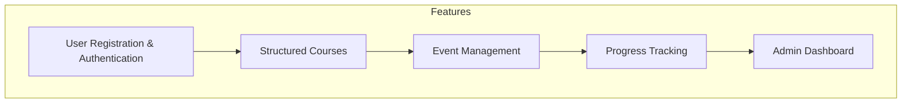
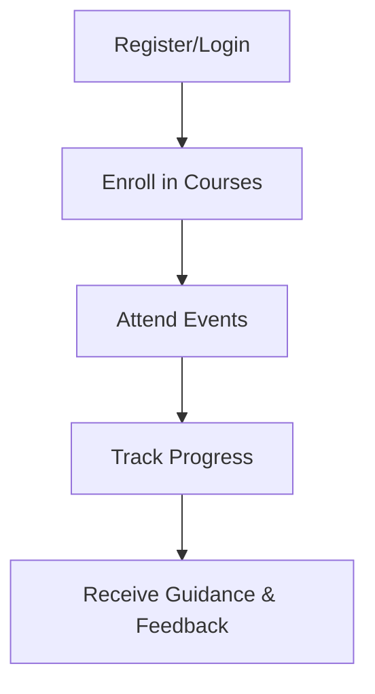
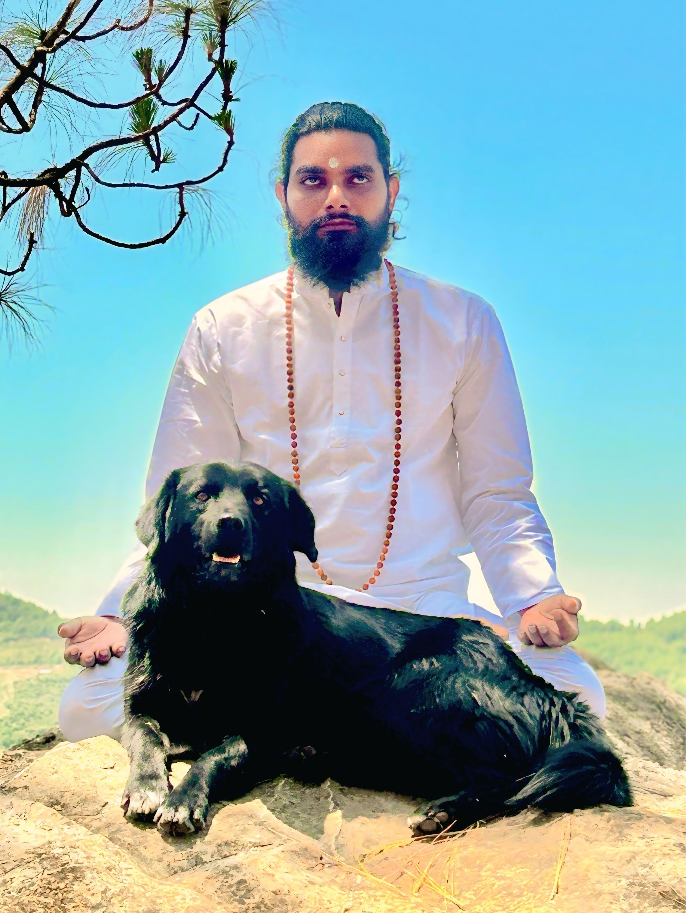
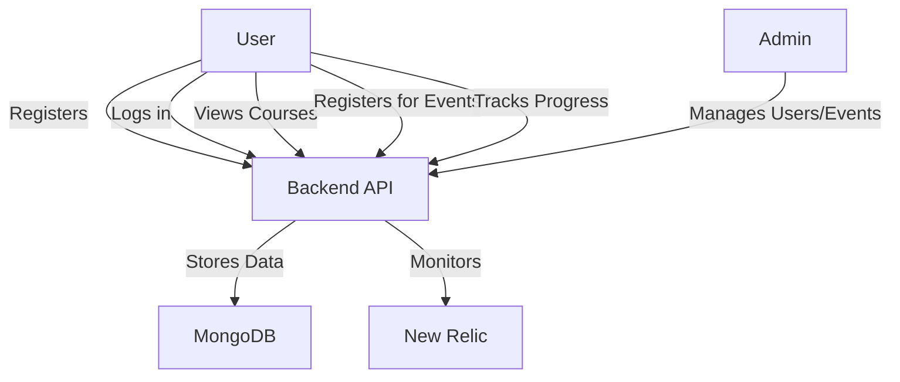

# Sivoham MVP Presentation

---

## Slide 1: Title & Branding

**Sivoham: Spiritual Growth Platform**  
Empowering seekers on the path of self-realization

---

## Slide 2: The Vision

“Sivoham is a digital platform designed to guide and support spiritual seekers through structured courses, events, and community engagement.”

Inspired by Guru Sree Jeeveswara Yogi’s teachings.

---

## Slide 3: Key Features

- User registration & authentication (secure, OTP-based)
- Structured spiritual courses with video content
- Event registration & management
- Progress tracking & feedback
- Admin dashboard for approvals and analytics

---

## Slide 4: User Journey

---

## Slide 5: Courses Experience

- Step-by-step video courses
- Progress unlocks new levels
- Integrated feedback and meditation tests

**[Insert Screenshot of Courses Page Here]**

---

## Slide 6: Events & Community

- Participate in spiritual events, both online and offline
- Easy registration and reminders

**[Insert Screenshot of Events Page or Registration Dialog Here]**

---

## Slide 7: Progress Tracking

- Visualize your spiritual journey
- Export analytics for self-review

**[Insert Screenshot of Progress Page Here]**

---

## Slide 8: Admin Dashboard

- Admins can approve users, manage events, and download analytics
- Ensures quality and engagement

**[Insert Screenshot of Admin Panel Here]**

---

## Slide 9: Technology Stack

- Node.js, Express, MongoDB, React, Material-UI, New Relic
- Robust, scalable, and secure architecture
- Cloud-ready and stateless backend

---

## Slide 10: Testimonials

> “I spent many years in Himalayas and travelled across India in pursuit of Moksha. Only a self-experienced person can guide others to the path of liberation. Guru Sree Jeeveswara Yogi is one of the rarest Advaitha Shaktipath Gurus. I feel so blessed and fortunate to have found him.”  
> — Ramananda Swami, Sanyasi, Badrinath

> “Parama Pujya Sree Jeeveswara Yogi is none the less than Dakshinamurthy himself disguised as a common man incarnated to uplift ignorant people like us with boundless Compassion. He is Shiva himself.”  
> — Mrs. Rajya Lakshmi, Retd. Teacher

---

## Slide 11: Demo Video (Optional)

**[Embed or link to a short screen recording showing registration, course navigation, event registration, and progress tracking]**

---

## Slide 12: Roadmap & Next Steps

- Upcoming features: mobile app, more courses, community forums
- Invite for feedback and collaboration

---

## Slide 13: Thank You & Contact

Thank you for your time!

**Contact:** [Insert Email/Website/QR Code]

 